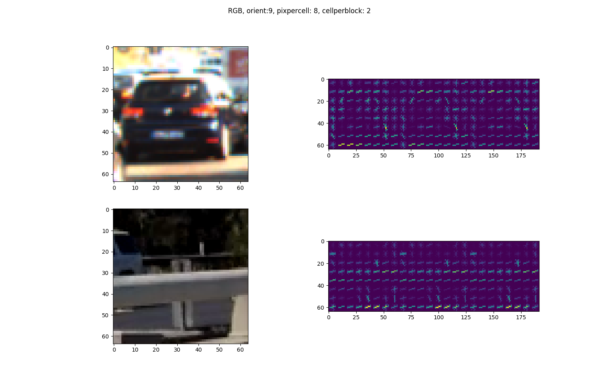
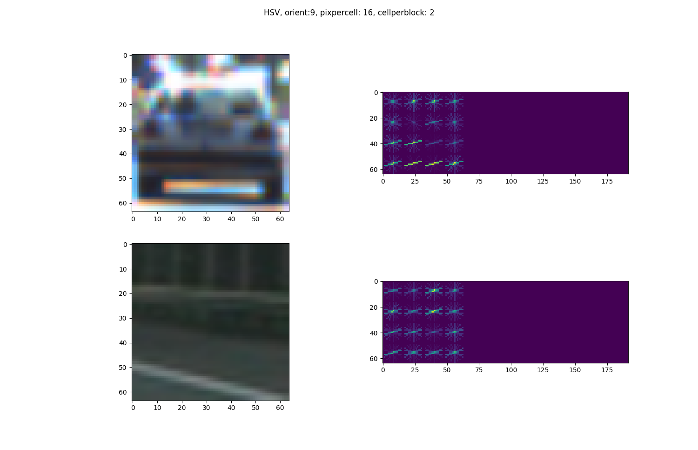
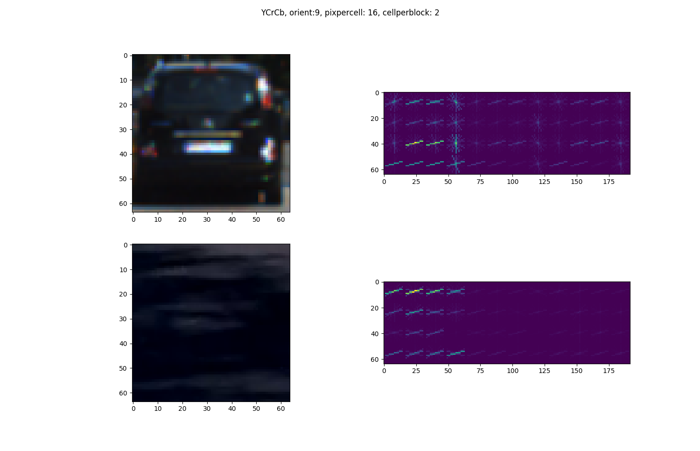
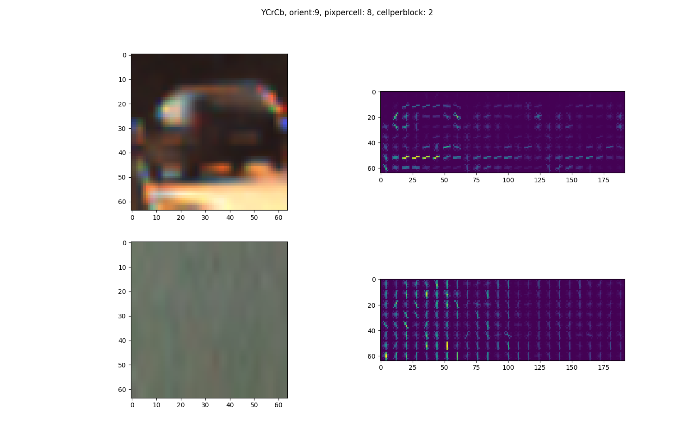

# Vehicle Detection
[](http://www.udacity.com/drive)


The goal of this project was to build a software pipeline that trains a SVM classifer to detect vehicles in images and draw bounding boxes around detections.  The pipeline was also required to be extended to detect  vehicles in frames of a  test video and mark bounding boxes. 

The pipeline has the folllowing  steps:

1. Image pre-processing
2. Feature extraction
3. SVM classifier training and tuning using a labeled dataset
4. A sliding window search to detect vehicles in a video

The pipeline is implemented in `VehicleDetection_pipeline.py`. All helper fuctions which include code from udacity lessons are available in `helper_functions.py`

Here I will elaborate how I implemented the pipeline to achieve all requirments specified in the [project rubric](https://review.udacity.com/#!/rubrics/513/view) 

### Histogram of Oriented Gradients (HOG)
The method `extract_features` and `single_img_features` in `VehicleDetection_pipeline.py` perform HOG feature extraction. I also use a histogrm of color channels (32 bins) and all spatial information available in the image (sub-sampled to (32,32)) as features.

#### HOG parameter selection
In order to decide what parameters will give the most expressive/rich and distinctive HOG feautres for vehicles I tried to visualise the results of HOG feature extraction for car and non-car images with different parameters.
The images below show hog features with the different combinations of color space, number of gradient orientations, pixel per cell and cells per block.






Looking at the visualizations, I observed that HOG features in _YCrCb_ colorspace captured shape of the vehicles best and are very different from nonvehicle hog features. So I decided to use _YCrCb_ color space for HOG feature extraction. 
#### SVM Classifier Training
 In order to decide the remaining parameters, I trained a SVM classifier using the features extracted with different sets of parameters and selected the values that gave best results. The method `vehicle_detection_training` performs SVM training. It first extracts features using `extract_features`, splits the dataset into train and test sets, and then trains a Linear SVM using the LinearSVC module from sklearn library.
 
 The following parameter sets were tested:
 ```
 HOG - orientation: 8, pix_per_cell: 8, cell_per_block:2,  SpatialSize =(32,32), Color histogram bins: 32
HOG - orientation: 9, pix_per_cell: 8, cell_per_block:2,  SpatialSize =(32,32), Color histogram bins: 32
HOG - orientation: 9, pix_per_cell: 8, cell_per_block:2,  No spatial features, Color histogram bins: 32
HOG - orientation: 9, pix_per_cell: 8, cell_per_block:2,  No spatial feaures, No color histogram
 ```
Out of these parameter sets, I saw the highest test accuracy (99.2%) with ` HOG - orientation: 9, pix\_per\_cell: 8, cell\_per\_block:2,  SpatialSize =(32,32), Color histogram bins: 32` 
 Even though this led to a feature vector  size of 8460, I decided to use this parameter set for the pipeline  since the classifier 
 
 

**As an optional challenge** Once you have a working pipeline for vehicle detection, add in your lane-finding algorithm from the last project to do simultaneous lane-finding and vehicle detection!

**If you're feeling ambitious** (also totally optional though), don't stop there!  We encourage you to go out and take video of your own, and show us how you would implement this project on a new video!

## How to write a README
A well written README file can enhance your project and portfolio.  Develop your abilities to create professional README files by completing [this free course](https://www.udacity.com/course/writing-readmes--ud777).

