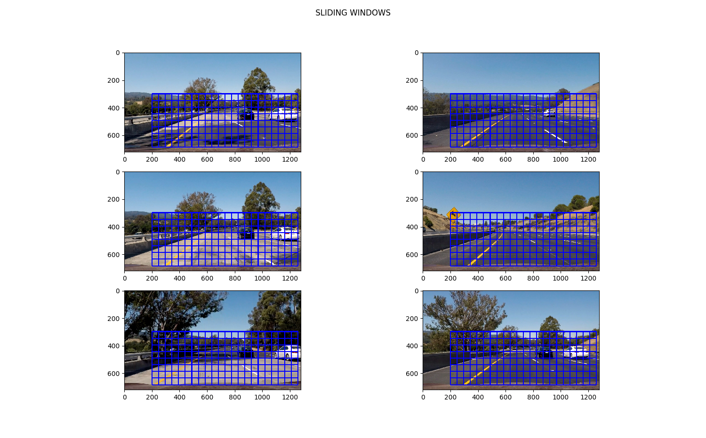
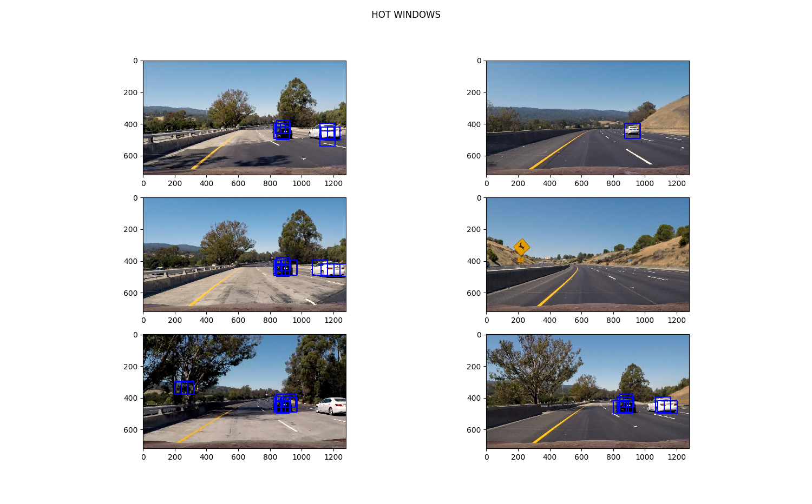
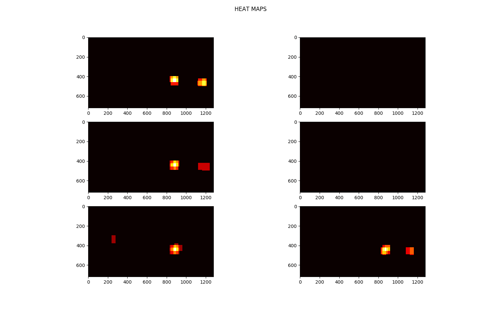

# Vehicle Detection
[](http://www.udacity.com/drive)


The goal of this project was to build a software pipeline that trains a SVM classifer to detect vehicles in images and draw bounding boxes around detections.  The pipeline was also required to be extended to detect  vehicles in frames of a  test video and mark bounding boxes. 

The pipeline has the folllowing  steps:

1. Image pre-processing
2. Feature extraction
3. SVM classifier training and tuning using a labeled dataset
4. A sliding window search to detect vehicles in a video

The pipeline is implemented in `VehicleDetection_pipeline.py`. All helper fuctions which include code from udacity lessons are available in `helper_functions.py`

Here I will elaborate how I implemented the pipeline to achieve all requirments specified in the [project rubric](https://review.udacity.com/#!/rubrics/513/view) 

### Histogram of Oriented Gradients (HOG)
The method `extract_features` and `single_img_features` in `VehicleDetection_pipeline.py` perform HOG feature extraction. I also use a histogrm of color channels (32 bins) and all spatial information available in the image (sub-sampled to (32,32)) as features.

#### HOG parameter selection
In order to decide what parameters will give the most expressive/rich and distinctive HOG feautres for vehicles I tried to visualise the results of HOG feature extraction for car and non-car images with different parameters.
The images below show hog features with the different combinations of color space, number of gradient orientations, pixel per cell and cells per block.


Looking at the visualizations, I observed that HOG features in _YCrCb_ colorspace captured shape of the vehicles best and are very different from nonvehicle hog features. So I decided to use _YCrCb_ color space for HOG feature extraction. 
#### SVM Classifier Training
 In order to decide the remaining parameters, I trained a SVM classifier using the features extracted with different sets of parameters and selected the values that gave best results. The method `vehicle_detection_training` performs SVM training. It first extracts features using `extract_features`, splits the dataset into train and test sets, and then trains a Linear SVM using the LinearSVC module from sklearn library.
 
 The following parameter sets were tested:
 ```
HOG - orientation: 8, pix_per_cell: 8, cell_per_block:2,  SpatialSize =(32,32), Color histogram bins: 32
HOG - orientation: 9, pix_per_cell: 8, cell_per_block:2,  SpatialSize =(32,32), Color histogram bins: 32
HOG - orientation: 9, pix_per_cell: 8, cell_per_block:2,  No spatial features,   Color histogram bins: 32
HOG - orientation: 9, pix_per_cell: 8, cell_per_block:2,  No spatial feaures,     No color histogram
 ```
Out of these parameter sets, I saw the highest test accuracy (99.2%) with ` HOG - orientation: 9, pix_per_cell: 8, cell_per_block: 2,  SpatialSize =(32,32), Color histogram bins: 32` 
Due to the high test accuracy, I decided to use this parameter set for the pipeline even though these parameters lead to a vector  size of 8460, 
 

### Sliding Window Search
A sliding window search mechanism has been implemented to be able to search for vehicles in frames of a video. The method `sliding_windows` and `search_windows` facilitate the sliding window mechanism. The `sliding_windows` methods creates a list of bounding boxes of a specified size, specified overlap ratio and start stop bounds. The `search_window`method extracts the image patch within each bounding box, extracts features and classifes whether there is a vehicle in the image.

After trying many different window sizes and overlap ratios, I decided to perform sliding window at 3 scales 
```
window search 1: size=(64,64) overlap=(0.5,0.5), y_start_stop=[300,700] , x_start_stop=[200,1280]
window search 2: size=(96,96) overlap=(0.5,0.5), y_start_stop=[300,700], x_start_stop=[200,1280]
window search 3: size=(80,80) overlap=(0.5,0.5), y_start_stop=[300,700], x_start_stop=[200,1280]
```

I chose the three window sizes to be able to capture vehicles at different scales in the image. Vehicles at a greater distance from camera are captured by smaller windows and vehicles closer to camera are captured by larger windows. Also, activations at different scales can be used combined to measure confidence in classification result. The `y_start_stop` bounds are used to minimise false positives. It limits the search to the relevant part of image and reduces false positives.

In order to combine results from different window sizes into single bounding box, a heatmap is built.To build heatmap, a binary image containing all zeros is created and then values of  pixels that lie inside windows where vehicles were found are  incremented. In the end a threshold is applied to this heatmap such that pixels with values less than threshold are set to zero. This gives the final heat map and bounding boxes for neighboring 'hot' pixels are computed. This functionality is achieved via method `build_heatmap`

The figures below results of all steps in the sliding window search



VEHICLE DETECTION


This setup resulted in high detection rate and low false positives. 

### Video Implementation
The processed project video is available [here](output_video/outproject_video_final.mp4)

In order to make the vehicle detection robust and reduce false positives I implemented a evidence accumulating scheme across frames. This is available in the class `HotWindows` in helper_functions.py
The idea is that it keeps accumulating windows across frames into a list till it reaches a max number. The heatmap is build all the accumulated hot windows. Once the accumulated windows exceed the max limit, the oldest frames are discarded before the new frames are added to the list.

### Discussion
1. While building the pipeline, I felt that there is no good way to judge the quality of features except visual inspection. I was not able to spend enough time on finding relevant literature.
2. False positives were another problem that I encountered. Even though applying heatmaps helped it did not completely resolve the problem. 
3. Another point of frustration was not being able to explain why certain patches of road or trees get classified as cars. This could probably be due to relatively small datasets and not enough negative. I felt like a way to visualise the feature space andsvm decision boundary might have helped
4. Some  more things I would have liked to explore were
	* Whether the SVM was overfitting to the training set and how to apply regularization
	* What feature vector size works best with SVMs 
	* What other feature vectors have been used that work well in object classification
	

References:
[Fundamentals of HOG](https://www.learnopencv.com/histogram-of-oriented-gradients/) 
Udacity Self Driving Car lesson
